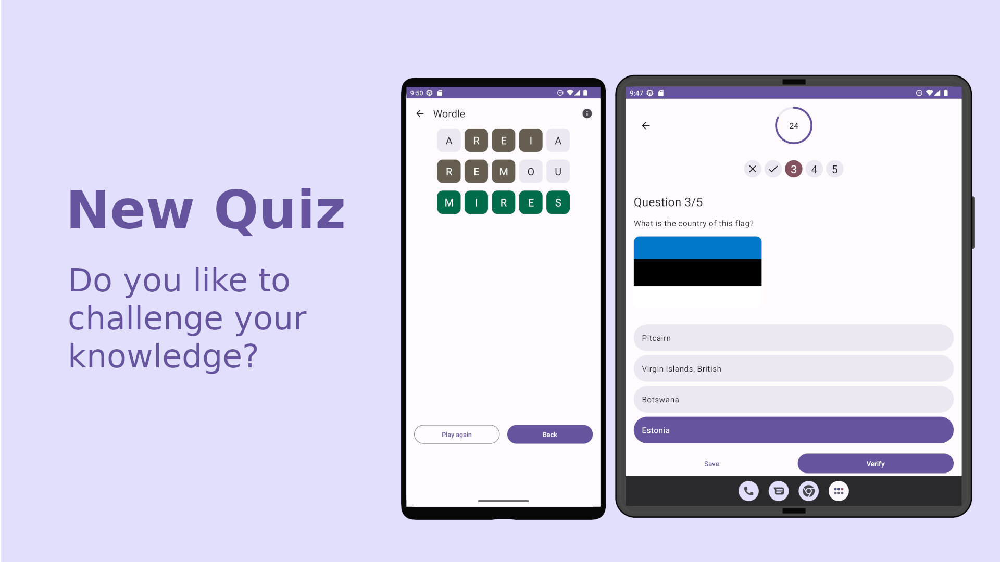
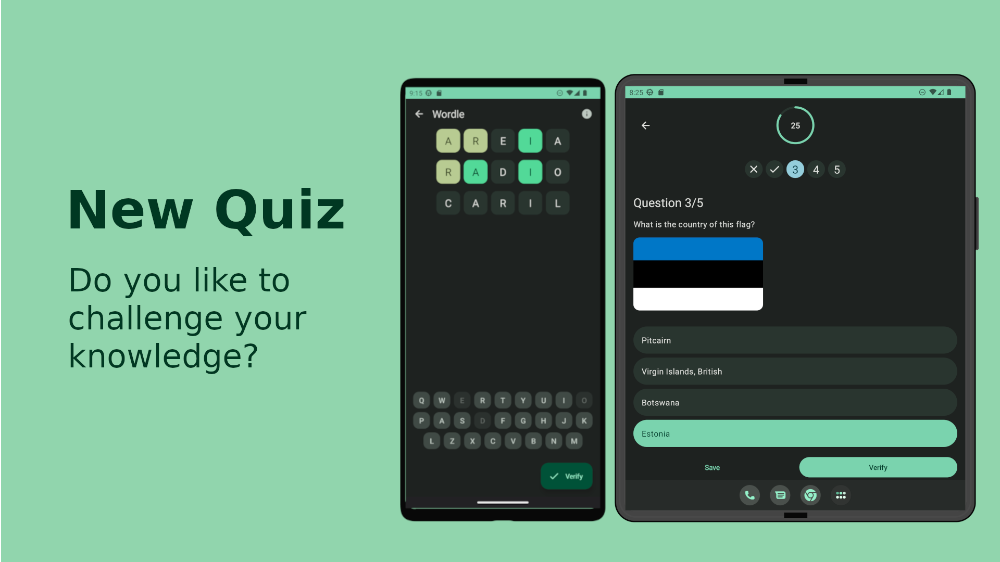

# New Quiz

Do you like to challenge your knowledge? So NewQuiz is the ideal game for you.

New quiz is optimized to material you, the theme of new quiz will adapt to your background.

## Features

- Maze: Game mode with all other NewQuiz game modes in one quiz.

- Multi choice quiz
    - Logo quiz
    - Flag quiz
    - Solve the formula equation
    - Number trivia
- Wordle
    - Guess the text word
    - Guess the number
    - Guess the math formula
    - Number trivia

## Build With

- [MVVM](https://en.wikipedia.org/wiki/Model%E2%80%93view%E2%80%93viewmodel) is an architectural pattern in computer software that facilitates the separation of the development of the graphical user interface

- [Jetpack Compose:](https://developer.android.com/jetpack/compose) Jetpack Compose is Android’s modern toolkit for building native UI.
- [Material 3:](https://m3.material.io/) Design and build beautiful, usable products with Material3.
- [Kotlin:](https://kotlinlang.org/) A modern programming language that makes developers happier.
- [Kotlin Coroutines:](https://github.com/Kotlin/kotlinx.coroutines) Asynchronous or non-blocking programming
- [Dagger Hilt:](https://github.com/google/dagger) A fast dependency injector for Java and Android.
- [Ktor:](https://ktor.io/) For asynchronous HTTP client requests.
- [Lottie Android:](https://github.com/airbnb/lottie-android/) Lottie is a library that parses Adobe After Effects animations exported as json.
- [Compose destinations:](https://github.com/raamcosta/compose-destinations) Annotation processing library for type-safe Jetpack Compose navigation with no boilerplate.

## Question Data Source

- Multi choice quiz
  - [OpenTDB:](https://opentdb.com/) multi choice questions
  - [NumbersAPI:](http://numbersapi.com) api for number trivia questions
  - [Country flags:](https://countryflagsapi.com/png) flag images
- Wordle
  - [Spanish and French words](https://github.com/lorenbrichter/Words)