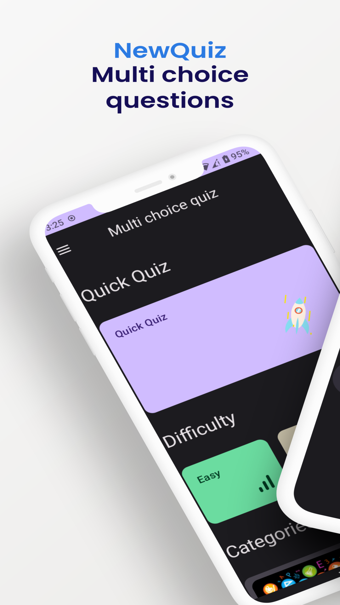
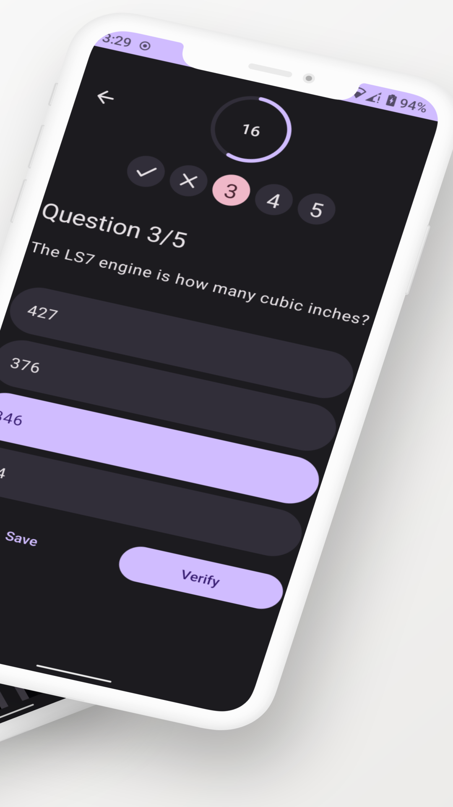
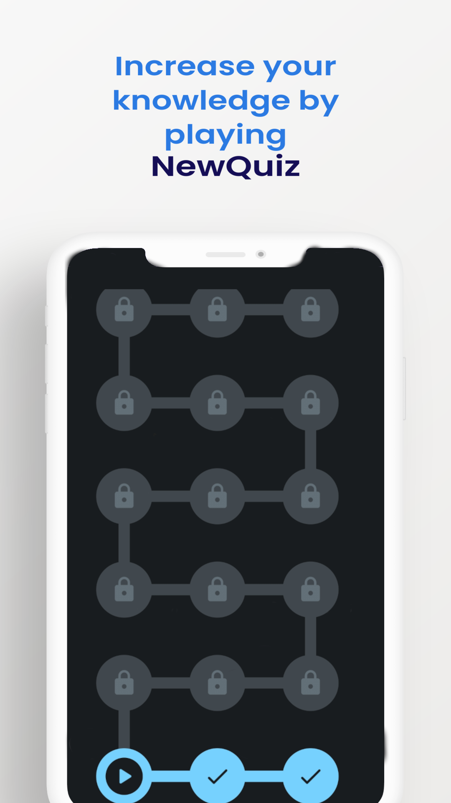
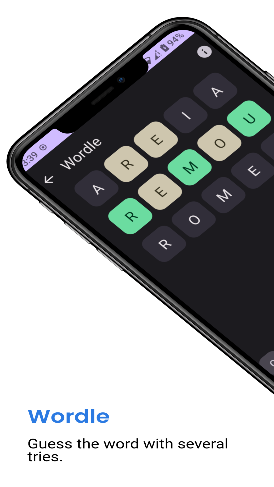
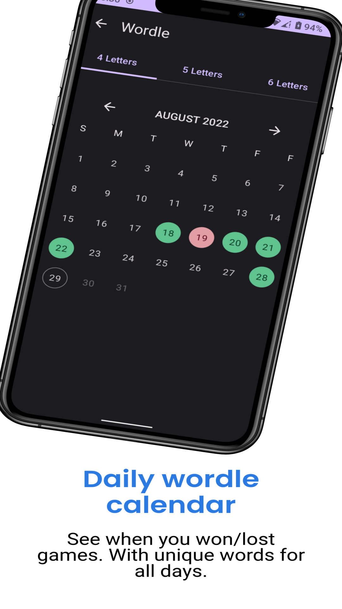

# New Quiz

Do you like to challenge your knowledge? So NewQuiz is the ideal game for you.

## Multi choice quiz

- Several categories to choose from.
- Several questions to play.
- Multiple and true/false choice questions.
- 3 difficulty levels: easy, medium and difficult.

## Flag Quiz

Guess the country with the image of the flag. With 4 answers to choose.

## Logo Quiz

Guess the logo with the image, with 4 answers to choose.

## Wordle quiz

Guess the word with several tries. You have daily words you have one new word per day and at most 6 tries or infinite words you have random words and infinite tries.

Spanish and French words are from [Words](https://github.com/lorenbrichter/Words).

## Maze

Have you ever thought of having all the game modes in one quiz? Then play the maze and you'll have a completely randomized game with all NewQuiz game modes.

## Material you 

New quiz is optimized to material you, the theme of new quiz will adapt to your background.

