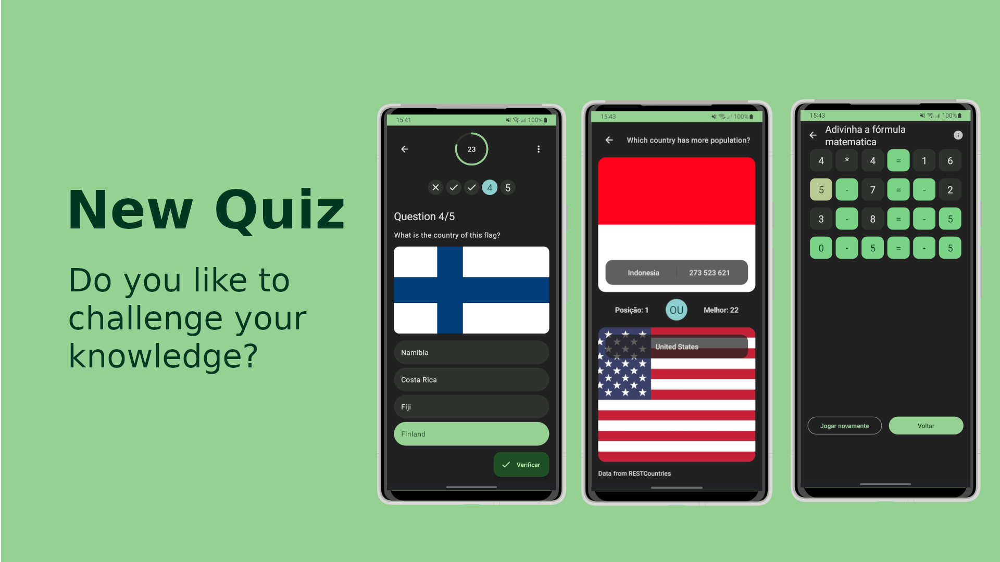

# New Quiz

[](https://github.com/joaomanaia/newquiz/releases/tag/1.6.2)
[](https://github.com/joaomanaia/newquiz/actions/workflows/android.yml)
[](https://www.apache.org/licenses/LICENSE-2.0)
[](https://hosted.weblate.org/engage/newquiz)

<a href='https://www.amazon.com/InfinitePower-NewQuiz/dp/B08T8JN4P9'></a>

Do you like to challenge your knowledge? So NewQuiz is the ideal game for you.


New quiz is optimized to material you, the theme of new quiz will adapt to your background.



# Features

- Maze: Game mode with all other NewQuiz game modes in one quiz.

- Multi choice quiz
  - Logo quiz
  - Flag quiz
  - Solve the formula equation
  - Number trivia
  
- Wordle
  - Guess the text word
  - Guess the number
  - Guess the math formula
  - Number trivia
  
 - Comparison Quiz
   - Compare the country population 

# Build With

- [MVVM](https://en.wikipedia.org/wiki/Model%E2%80%93view%E2%80%93viewmodel) is an architectural pattern in computer software that facilitates the separation of the development of the graphical user interface

- [Jetpack Compose:](https://developer.android.com/jetpack/compose) Jetpack Compose is Android’s modern toolkit for building native UI.
- [Material 3:](https://m3.material.io/) Design and build beautiful, usable products with Material3.
- [Kotlin:](https://kotlinlang.org/) A modern programming language that makes developers happier.
- [Kotlin Coroutines:](https://github.com/Kotlin/kotlinx.coroutines) Asynchronous or non-blocking programming
- [Dagger Hilt:](https://github.com/google/dagger) A fast dependency injector for Java and Android.
- [Ktor:](https://ktor.io/) For asynchronous HTTP client requests.
- [Lottie Android:](https://github.com/airbnb/lottie-android/) Lottie is a library that parses Adobe After Effects animations exported as json.
- [Compose destinations:](https://github.com/raamcosta/compose-destinations) Annotation processing library for type-safe Jetpack Compose navigation with no boilerplate.

# Question Data Source

- [FlagCDN:](https://flagcdn.com/) country flag images

- Multi choice quiz
  - [OpenTDB:](https://opentdb.com/) multi choice questions
  - [NumbersAPI:](http://numbersapi.com) api for number trivia questions
- Wordle
  - [Spanish and French words](https://github.com/lorenbrichter/Words)
- Comparison Quiz
  - [Rest Countries:](https://restcountries.com/) country information
  - [TMDB:](https://www.themoviedb.org/) data about movies

# Translation

Hello and thank you for your interest — NewQuiz is being translated using [Weblate](https://weblate.org/), a web tool designed to ease translating for both developers and translators.

[](https://hosted.weblate.org/engage/newquiz/)

# Run the project locally

## Requirements

- [Android Studio](https://developer.android.com/studio) Hedgehog 2023.1.1 Canary 16 or later. Or use an other version of [Android Studio](https://developer.android.com/studio) but you need to change the gradle version to be compatible with your version of [Android Studio](https://developer.android.com/studio).
  
- Java 17 or later.

## Build and Run

1. First clone the repository

```bash
git clone https://github.com/joaomanaia/newquiz.git
```

2. Open the project in [Android Studio](https://developer.android.com/studio).

3. Add firebase to the project

   1. Go to [Firebase](https://firebase.google.com/) and create a new project.
   2. Add an android app to the project.
   3. Download the google-services.json file.
   4. Copy the file to the app folder.

4. Click the run button.

> **Warning**: FOSS Builds still contains proprietary code, such as Firebase, Crashlytics, and Google Play Services. In the future all proprietary code will be removed from the FOSS Builds.

> **Warning**: To run the project locally you need to add firebase to the project, otherwise the you cannot build and run the project.
